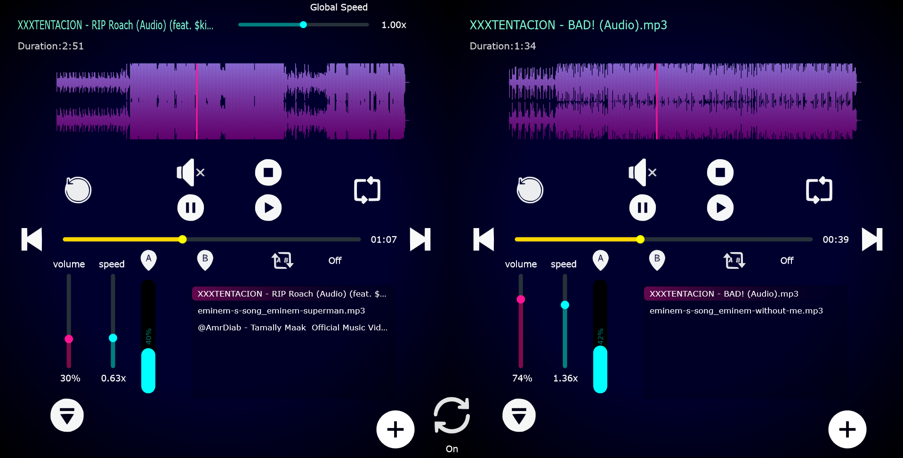

# 🎧 Professional Dual-Deck Audio Player

A high-performance, cross-platform audio application built with **C++** and the **JUCE Framework**. This project features a sophisticated dual-deck architecture, real-time audio manipulation, and a modern "Glassmorphic" user interface.

## 🚀 Overview
The application is designed to provide a professional audio playback experience with two independent decks. Each deck operates its own audio engine, allowing for simultaneous playback, independent speed control, and advanced looping capabilities.

---

## ✨ Key Features

### 🎛️ Dual-Deck Control
* **Independent Playback**: Two separate instances of the audio engine running side-by-side.
* **Speed/Pitch Shifting**: Real-time manipulation of playback speed (0.01x to 2.0x) with high-fidelity resampling.
* **A-B Looping**: Define precise start (A) and end (B) points for seamless phrase looping.
* **Global Sync**: A "Global Speed" slider to control both decks simultaneously for harmonic mixing.

### 🎨 Advanced UI/UX (Cyberpunk Aesthetic)
* **Glassmorphism**: Semi-transparent UI elements that blend beautifully with a deep blue radial gradient background.
* **Neon Waveforms**: Real-time, interactive purple neon waveform displays that track playback position with high precision.
* **Interactive Playlist**: A sleek `ListBox` that supports multi-file queuing and displays an "Add to Queue" prompt when empty.
* **Custom Iconography**: Fully integrated SVG-based drawable buttons for a sharp, modern look at any window size.

### ⚙️ Audio Engineering
* **Multiformat Support**: Seamlessly handles `.wav`, `.mp3`, and other standard formats.
* **Audio Processing**: Utilizes `juce::AudioTransportSource` and `juce::ResamplingAudioSource` for smooth gain and speed transitions.
* **Asynchronous Loading**: File I/O is handled on background threads to ensure the GUI remains buttery smooth.

---

## 📂 Project Structure

| File | Description |
| :--- | :--- |
| **Main.cpp** | Application entry point and window management. |
| **MainComponent** | The master container that bridges the two audio decks. |
| **PlayerAudio** | The back-end logic: handling playback, resampling, and looping. |
| **PlayerGUI** | The front-end: custom painting, Glassmorphic effects, and waveform rendering. |

---

## 🛠️ Build Instructions

1. **Prerequisites**:
   - Install the [JUCE Framework](https://juce.com/download/).
   - A C++17 compatible IDE (Visual Studio 2022, Xcode, or CLion).

2. **Setup**:
   - Open `AudioPlayer.jucer` in the **Projucer**.
   - Select your exporter (e.g., Visual Studio 2022).

3. **Compile**:
   - Save and open the project in your IDE.
   - Build the solution in **Release** mode for best audio performance.

---

## 📸 Visuals

  

---

## 🏗️ Architecture
The application follows a decoupled Architecture to ensure thread safety between the UI and the high-priority Audio Thread.

  

---

## 👤 Authors

**Mahmoud Ahmed**
* **LinkedIn**: [linkedin.com/in//mahmoud-ahmed-93613b338](www.linkedin.com/in/mahmoud-ahmed-93613b338) 

**Ziad Yahia**
* **LinkedIn**: [linkedin.com/in//ziad-yahia-408615322](https://www.linkedin.com/in/ziad-yahia-408615322) 

**Mina Hany**
* **LinkedIn**: [linkedin.com/in//mina-hany-8b97003ab](https://www.linkedin.com/in/mina-hany-8b97003ab) 

---

*Developed with ❤️ using C++ and JUCE.*
